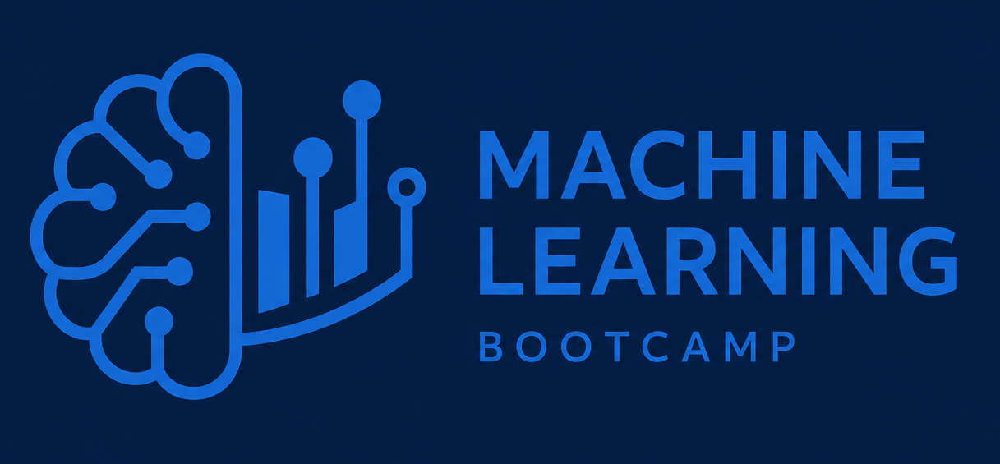

  

# ML Bootcamp

This repository is an archive and collection of all MLCon Machine Learning
Bootcamps. Each edition lives in its own folder and contains the hands-on labs,
notebooks, slides, and setup instructions used for that conference.

## Editions

| Year | Conference | Folder |
|------|------------|--------|
| 2025 | MLCon | [`mlcon/`](mlcon/) |
| 2026 | MLCon Munich | [`2026-mlcon-munich/`](2026-mlcon-munich/) |

See each edition's `README.md` for detailed setup and usage instructions.
